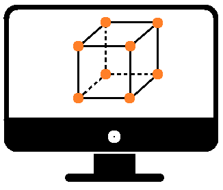
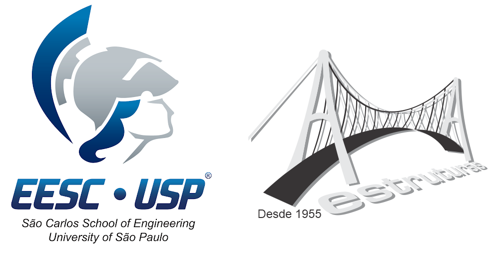

# O2P2 [](https://zenodo.org/badge/latestdoi/519514823)
[](https://github.com/GEMeCo/O2P2/blob/main/LICENSE) [](https://github.com/GEMeCo/O2P2/issues) [](https://github.com/GEMeCo/O2P2/stargazers)

O2P2 is an C++ environment developed for non-linear coupled thermo-mechanical analyzes with the finite element method based on positions. It is under development at Sao Carlos School of Engineering, University of Sao Paulo.

<h1 align="center">
  
</h1>

## Copyright Information:
:ballot_box_with_check: This program is free software: you can redistribute it and/or modify it under the terms of the [Apache License 2.0](https://www.apache.org/licenses/LICENSE-2.0).

:ballot_box_with_check: Redistributions of source code must retain the above copyright notice, this list of conditions and the disclaimer.

:ballot_box_with_check: Redistributions in binary form must reproduce the above copyright notice, this list of conditions and the disclaimer in the documentation and/or other materials provided with the distribution.

:ballot_box_with_check: This program is distributed in the hope that it will be useful, but WITHOUT ANY WARRANTY; without even the implied warranty of MERCHANTABILITY or FITNESS FOR A PARTICULAR PURPOSE.
It is provided "AS IS". In no event shall the authors be liable for any claim, damages or other liability, whether in an action of contract, tort or otherwire, arising from, out of or in connection with the software or the use of other dealing in the software.

:ballot_box_with_check: Neither the name of the copyright holder nor the names of any other contributors may be used to endorse or promote products derived from this software without specific prior written permission.

:ballot_box_with_check: This is a research software. There are neither pre-processor nor post-processor (so far). Output was made only for displacements, using AcadView. You may find it [here](https://set.eesc.usp.br/?page_id=237).

:triangular_ruler: None of the developers are **Software Engineers** of any sort. We are **Civil Engineers**, seeking to solve engineering problems. We know that this software has bugs and stuff to improve. We just don't have time to solve them all.

Documentation of this work, generated by doxygen, may also be used, distributed and modified, but under [Creative Commons Attribution-NonCommerical 4.0 International license](https://creativecommons.org/licenses/by-nc/4.0/).

<h1 align="center">
  
</h1>

## :warning: Under development - Use at your own risk. Improper use will crash your application.

Table of Contents
=================
<!--ts-->
   * [About](#about)
   * [Citation](#citation)
   * [Features](#features)
   * [Resources](#resources)
   * [Building and Running](#how-to-run)
   * [Documentation](#documentation)
   * [Project Manager](#project)
   * [Contributions](#contributions)
   * [How to contribute](#how-to-contribute)
   * [Acknowledgement](#acknowledgement)
<!--te-->

About
-----
O2P2 is an object oriented framework for the Positional Finite Element Method applied to Thermomechanical Problems. It was developed for non-linear coupled thermo-mechanical analyzes (:construction: We'll get there, eventually :construction:).

Citation
--------
  Whether it was used in whole or parts, citation is a must! Our software is under development, and a proper presentation paper is underway.

  Our software is in Zenodo - thus, we got a DOI: [doi.org/10.5281/zenodo.7102199](https://doi.org/10.5281/zenodo.7102199)
  
  Nevertheless, if you may, please cite the one following papers (as they were used for initial validations):
  - :green_book: CARRAZEDO, R.; CODA, H. B. Triangular based prismatic finite element for the analysis of orthotropic laminated beams, plates and shells. Composite Structures, v. 168, p. 234-246, 2017.
  DOI: [10.1016/j.compstruct.2017.02.027](https://doi.org/10.1016/j.compstruct.2017.02.027)
  - :green_book: CARRAZEDO, R.; PACCOLA, R. R.; CODA, H. B. Active face prismatic positional finite element for linear and geometrically nonlinear analysis of honeycomb sandwich plates and shells. Composite Structures, v. 200, p. 849-863, 2018.
  DOI: [10.1016/j.compstruct.2018.06.009](https://doi.org/10.1016/j.compstruct.2018.06.009)
  - :green_book: CARRAZEDO, R.; PACCOLA, R. R.; CODA, H. B.; SALOMÃO, R. C. Vibration and stress analysis of orthotropic laminated panels by active face prismatic finite element. Composite Structures, v. 244, n. 112254, 2020.
  DOI: [10.1016/j.compstruct.2020.112254](https://doi.org/10.1016/j.compstruct.2020.112254)

Features
--------
- v0.2.0: Dynamic mechanical analysis.
    -  :boom: Newmark-beta time step integration method.

- v0.1.0: Geometric nonlinear mechanical analysis with SVK constitutive model.
    - :boom: Geometrically nonlinear mechanical analysis using the Finite Element Method based on Positions;
    - :boom: Bi and Tridimensional environments;
    - :boom: Linear, plane and solid finite elements;
    - :boom: SVK hyperelastic constitutive model;
    - :boom: Parallel processing using standard C++ functions;
    - :boom: Output .ogl files for post-process in [AcadView](https://set.eesc.usp.br/?page_id=237).

Resources
---------
We are using the following libraries, resources and technologies:

- [Eigen C++ Libraries, version 3.4.0](https://eigen.tuxfamily.org/)
- [Microsoft Visual Studio Community 2022, Version 17.3.4](https://visualstudio.microsoft.com/)
- [Intel C++ Compiler, Package ID: w_oneAPI_2022.1.0.256](https://software.intel.com/content/www/us/en/develop/tools/oneapi.html)
- [Doxygen, version 1.9.5](https://doxygen.nl/)
- [AcadView](https://set.eesc.usp.br/?page_id=237)

Building and Running
--------------------
1. Clone the source code
`git clone https://github.com/GEMeCo/O2P2.git`

2. Install development dependencies and resources. Just check above.

3. We provided the .vsxproj file. Some configuration may be needed. Good luck :innocent:.

4. Run the executable file and input the project file. Check the documentation to create the project file.

Documentation
-------------
Software documentation is made directly from annotated sources by doxygen. Use doxywizard to create the documentation.

Project Manager
---------------
[Rogério Carrazedo](https://orcid.org/0000-0003-2750-034X)

PhD obtained in 2009 from The University of Sao Paulo (USP) at Sao Carlos School of Engineering (EESC).

Joined the Federal University of Technology - Paraná (Brazil) as Assistant Professor in 2010.

Joined the University of Sao Paulo at Sao Carlos School of Engineering, in the Structural Engineering Department in 2015.

Associate Professor since 2020. Has worked on several research projects dealing with static and dynamic behaviour of composite structures using an alternative version of the Finite Element Method, based on Positions.

Contribution
------------
 - [Rafael Correa Salomão](http://lattes.cnpq.br/4408319800130401)
 - [Emerson Felipe Felix](https://orcid.org/0000-0002-8928-9474)
 - [Alexandre Ten Cate Matté](https://lattes.cnpq.br/8144116395864291)
 - [Chiara Pinheiro Teodoro](http://lattes.cnpq.br/6999948388655115)

How to contribute
-----------------
```bash
Sorry, but we are not accepting external contributions, at least yet.
Only students supervised by the head of this project may contribute.
Nevertheless, you may use it as seen fit.
```

Acknowledgement
---------------
<h1 align="center">
  
</h1>

